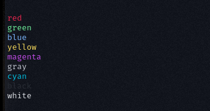
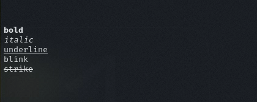

### Colors


```go
package main
import (
        "fmt"
        "github.com/polarspetroll/gocolor"
)


func main() {
        fmt.Println(gocolor.ColorString("red", "red", ""))
        fmt.Println(gocolor.ColorString("green", "green", ""))
        fmt.Println(gocolor.ColorString("blue", "blue", ""))
        fmt.Println(gocolor.ColorString("yellow", "yellow", ""))
        fmt.Println(gocolor.ColorString("magenta", "magenta", ""))
        fmt.Println(gocolor.ColorString("gray", "gray", ""))
        fmt.Println(gocolor.ColorString("cyan", "cyan", ""))
        fmt.Println(gocolor.ColorString("black", "black", ""))
        fmt.Println(gocolor.ColorString("white", "white", ""))
}
```
- output



---
### formats

```go
package main
import (
        "fmt"
        "github.com/polarspetroll/gocolor"
)


func main() {
        fmt.Println(gocolor.ColorString("bold", "", "bold"))
        fmt.Println(gocolor.ColorString("italic", "", "italic"))
        fmt.Println(gocolor.ColorString("underline", "", "underline"))
        fmt.Println(gocolor.ColorString("blink", "", "blink"))
        fmt.Println(gocolor.ColorString("strike", "", "strike"))
}
```

- output


